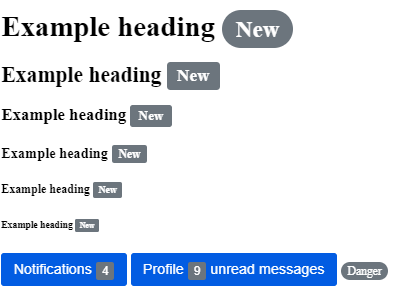

```html

<h1>Example heading <span class="badge rounded-pill bg-secondary">New</span></h1>
<h2>Example heading <span class="badge bg-secondary">New</span></h2>
<h3>Example heading <span class="badge bg-secondary">New</span></h3>
<h4>Example heading <span class="badge bg-secondary">New</span></h4>
<h5>Example heading <span class="badge bg-secondary">New</span></h5>
<h6>Example heading <span class="badge bg-secondary">New</span></h6>


<button type="button" class="btn btn-primary">
  Notifications <span class="badge bg-secondary">4</span>
</button>

<!-- for screen reader -->
<button type="button" class="btn btn-primary">
  Profile <span class="badge bg-secondary">9</span>
  <span class="sr-only">unread messages</span>
</button>


<!-- rounded-pill -->
<span class="badge rounded-pill bg-danger">Danger</span>
```

```css
.badge {
  color: #fff;
  vertical-align: middle;
  font-size: 0.8em;
  padding: 0.25em 0.6em;
  background: #6C757D;
  border-radius: 0.2em;
}
/* 유틸리티 */
.rounded-pill {
  border-radius: 1em;
}
/* 버튼 */
.btn{
  color: #fff;
  font-size: 1rem;
  background: #025CE2;
  border:none;
  border-radius: 0.2em;
  padding: 0.6em 0.8em;
}
```



