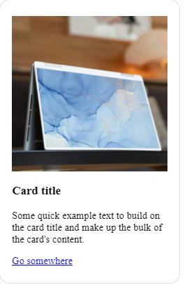

- default width는 100%
- 

```html
<div class="card" style="width: 18rem;">
  
  <div class="card-body">
    <h5 class="card-title">Card title</h5>
    <p class="card-text">Some quick example text to build on the card title and make up the bulk of the card's content.</p>
    <a href="#" class="btn btn-primary">Go somewhere</a>
  </div>
</div>
```

```css
/* default */
*{
  box-sizing: border-box;
  margin:0;
  padding:0;
}
.card{
  border: 1px solid #ddd;
  border-radius: 1em;
  padding: 1.6em 1.2em;
}
.card-img-top{
  width: 100%;
  margin-bottom: 1em;
}
.card-title{
  margin-bottom: 1em;
}
.card-text{
  margin-bottom:1em;
}
.btn{
  
}

```

