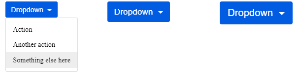
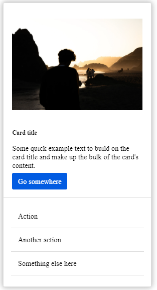

## border를 이용해 삼각형 만들기

```css

span{
  display:inline-block;
  border-top: 1em solid ;
  border-left: 1em solid transparent;
  border-right: 1em solid transparent;
}


정삼각형{
  display:inline-block;
  border-top: 1.15em solid ;
  border-left: 1em solid transparent;
  border-right: 1em solid transparent;
}
```

## Dropdown 스타일링

```html
<div>
  <div class="dropdown">
    <button class="btn btn-secondary dropdown-toggle" type="button" id="dropdownMenuButton" data-toggle="dropdown" aria-haspopup="true" aria-expanded="false">
      Dropdown
    </button>
    <div class="dropdown-menu" aria-labelledby="dropdownMenuButton">
      <a class="dropdown-item" href="#">Action</a>
      <a class="dropdown-item" href="#">Another action</a>
      <a class="dropdown-item" href="#">Something else here</a>
    </div>
  </div>
</div>
<div>  
  <div class="dropdown text-md">
    <button class="btn btn-secondary dropdown-toggle" type="button" id="dropdownMenuButton" data-toggle="dropdown" aria-haspopup="true" aria-expanded="false">
      Dropdown
    </button>
    <div class="dropdown-menu" aria-labelledby="dropdownMenuButton">
      <a class="dropdown-item" href="#">Action</a>
      <a class="dropdown-item" href="#">Another action</a>
      <a class="dropdown-item" href="#">Something else here</a>
    </div>
  </div>
</div>
<div class="lg">
  <div class="dropdown text-lg">
    <button class="btn btn-secondary dropdown-toggle" type="button" id="dropdownMenuButton" data-toggle="dropdown" aria-haspopup="true" aria-expanded="false">
      Dropdown
    </button>
    <div class="dropdown-menu" aria-labelledby="dropdownMenuButton">
      <a class="dropdown-item" href="#">Action</a>
      <a class="dropdown-item" href="#">Another action</a>
      <a class="dropdown-item" href="#">Something else here</a>
    </div>
  </div>
</div>
```

```css
body {
  display: flex;
  justify-content: space-around;
}


.btn {
  color: #fff;
  font-size: 1rem;
  background: #025ce2;
  border: none;
  border-radius: 0.2em;
  padding: 0.6em 0.8em;
  cursor: pointer;
  margin-bottom: 1rem;
  outline: none;
}
.btn:hover {
  background: #026cf4;
}

.dropdown{
  position:relative;
}

.dropdown-menu:not(.show){
  display:none;
}

.dropdown-toggle{
  font-size: 1em;
  margin-bottom: 0;
  user-select: none;
  /*  btn margin 초기화  */
}
.dropdown-toggle:focus{
  background: #026cf4;
}
.dropdown-toggle::after {
    display: inline-block;
    content: "";
    vertical-align: middle;
    margin-left: 0.3em;
    border-top: .3em solid;
    border-right: .3em solid transparent;
    border-left: .3em solid transparent;
}

.dropdown-menu{
  position: absolute;
  z-index: 2;
  top:100%;
  left:0;
  display:inline-block;
  border: 1px solid #ddd;
  border-radius: 0.2em;
  font-size: 1em;
  padding: 0.5em 0;
  background: #fff;
  user-select:none;
}

.dropdown-menu > a{
  display:block;
  color: inherit;
  text-decoration: none;
  white-space: nowrap;
}
.dropdown-menu > a:last-child{
  margin-bottom: 0;
}
.dropdown-item{
  transition: background-color 0.1s linear;
  padding: 0.5em 1em;
}
.dropdown-item:hover{
  background-color: #eee;
}

.text-md{
  font-size: 1.2rem;
}

.text-lg{
  font-size: 1.4rem;
}

```

## 이벤트 바인딩

```js
const dropdownTogglers = document.querySelectorAll('.dropdown-toggle');
dropdownTogglers.forEach(toggler=>{
  toggler.addEventListener('click', function(){
    this.nextElementSibling.classList.toggle('show')
  })
});

const dropdownMenus = document.querySelectorAll('.dropdown-menu');
document.addEventListener('click', function(e){
  dropdownMenus.forEach((dropdownMenu,i)=>{
    if(e.target===dropdownTogglers[i]) return;
    if(e.target.closest('.dropdown-menu')!==dropdownMenu){
      dropdownMenu.classList.remove('show');
     }
  })

});
```


- Element.closest(selectors) : 자신부터 최상위 부모까지 selectors를 갖는 element를 찾는다.
- selectors? >> ex) 'p:hover, .toto + q' (DOM string)
- 메뉴 밖을 클릭할 경우 메뉴가 사라지게끔 document에 핸들러를 추가했다.
- em으로 스타일링했기 떄문에 컴포넌트의 font-size만 조절해도 모든 크기가 알맞게 바뀐다.
- 미디어 쿼리를 사용해 btn의 font-size를 조절할 경우 반응형이 완성된다.
- dropdown menu에 padding을 추가했는데 이렇게할 경우 item을 hover했을 떄 background처리가 불가능해 각 item에 padding을 줬다.
- white-space : nowrap으로 menu의 width를 더 넓게 잡았다.
- btn을 hover했을 때의 background 색상을 dropdown이 focus되었을 떄 background로 적용했다.
- z-index 고려할 것

```
$zindex-dropdown:                   1000;
$zindex-sticky:                     1020;
$zindex-fixed:                      1030;
$zindex-modal-backdrop:             1040;
$zindex-modal:                      1050;
$zindex-popover:                    1060;
$zindex-tooltip:                    1070;
```

## 다른 컴포넌트와의 호환성

drop menu를 card 컴포넌트와 혼용한 결과
  


```html
 <div class="dropdown-menu">
    <div class="card dropdown-item" style="width: 18rem;">
      
      <div class="card-body">
        <h5 class="card-title">Card title</h5>
        <p class="card-text">Some quick example text to build on the card title and make up the bulk of the card's content.</p>
        <a href="#" class="btn btn-primary">Go somewhere</a>
      </div>
    </div>
          <a class="dropdown-item" href="#">Action</a>
      <a class="dropdown-item" href="#">Another action</a>
      <a class="dropdown-item" href="#">Something else here</a>
  </div>

```

```css


.card{
  border-bottom: 1px solid #ddd;
  padding: 1.6em 1.2em;
  margin-bottom: 1em;
}
.card-img-top{
  width: 100%;
  margin-bottom: 1em;
}
.card-title{
  margin-bottom: 1em;
}
.card-text{
  margin-bottom:1em;
}

.card ~ .dropdown-item{
  border-bottom: 1px solid #ddd;
  padding: 1em;
  margin: 0 1em;
}
.card ~ .dropdown-item:last-child{
  margin-bottom: 1em;
}
.boxShadow{
  box-shadow: 0 0 15px #ccc,
    0 0 10px #bbb;
} 
```

- child combinator : div > p , div p
- adjacent sibling combinator : div + p (바로 다음의 일치하는 sibling)
- general sibling combinator : p ~ a  (첫 셀렉터 다음의 siblings)
- p[attribute]
- p[attribute='value']
- p:nth-child : n th child. p일 경우에만.
- p:nth-of-type : p 중 n번째
https://css-tricks.com/child-and-sibling-selectors/
https://www.w3schools.com/cssref/css_selectors.asp

## To do

접근성 관련된 부분 다시 보기
data-toggle 관련 다시 보기 