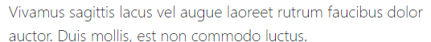
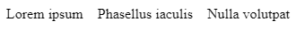

## Heading

1. `<h1>`~`<h6>`

default값

2. .h1~.h6

`<h>`태그가 아닐 경우 크기 설정

## .display-1~6

헤딩보다 더 크고 얇은 굵기의 font


## Lead



## inline text elements


```html
<p>You can use the mark tag to <mark>highlight</mark> text.</p>
<p><del>This line of text is meant to be treated as deleted text.</del></p>
<p><s>This line of text is meant to be treated as no longer accurate.</s></p>
<p><ins>This line of text is meant to be treated as an addition to the document.</ins></p>
<p><u>This line of text will render as underlined</u></p>
<p><small>This line of text is meant to be treated as fine print.</small></p>
<p><strong>This line rendered as bold text.</strong></p>
<p><em>This line rendered as italicized text.</em></p>
```

## .blockquotes


## Naming a source

```html

<figure>
  <blockquote class="blockquote">
    <p>Lorem ipsum dolor sit amet, consectetur adipiscing elit. Integer posuere erat a ante.</p>
  </blockquote>
  <figcaption class="blockquote-footer">
    Someone famous in <cite title="Source Title">Source Title</cite>
  </figcaption>
</figure>

```

## alignment

.text-center
.text-right
...

## Lists


```css

.list-unstyled{
  padding-left:0;
}
.list-unstyled > li{
  
    margin-left:0;
    list-style:none;
}
```
```html
<ul class="list-unstyled">
  <li>Lorem ipsum dolor sit amet</li>
  <li>Consectetur adipiscing elit</li>
  <li>Integer molestie lorem at massa</li>
  <li>Facilisis in pretium nisl aliquet</li>
  <li>Nulla volutpat aliquam velit
    <ul>
      <li>Phasellus iaculis neque</li>
      <li>Purus sodales ultricies</li>
      <li>Vestibulum laoreet porttitor sem</li>
      <li>Ac tristique libero volutpat at</li>
    </ul>
  </li>
  <li>Faucibus porta lacus fringilla vel</li>
  <li>Aenean sit amet erat nunc</li>
  <li>Eget porttitor lorem</li>
</ul>
```


## inline-list
```css
.list-inline{
  display: flex;
}
.list-inline-item{
  list-style:none;
  margin-right:1rem;
}
```

```html
<ul class="list-inline">
  <li class="list-inline-item">Lorem ipsum</li>
  <li class="list-inline-item">Phasellus iaculis</li>
  <li class="list-inline-item">Nulla volutpat</li>
</ul>
```



## description list alignment (텍스트 생략:truncate)

```css
*{
  box-sizing: border-box;
  padding:0;
  margin:0;
  margin-bottom: 1rem;
}
dl{
  padding: 1rem;
}
dt{
  font-weight:bold;
}
.row{
  display: flex;
  flex-wrap: wrap;
  width: 100%;
}
.col-sm-3{
  width: 25%;
}
.col-sm-9{

  width: 75%;
}
.col-sm-4{
  width: 33.333333%;
}
.col-sm-8{
  width: 66.666666%;
}
.text-truncate{
  white-space: nowrap;
  overflow: hidden;
  text-overflow: ellipsis;
}
```

```html
<dl class="row">
  <dt class="col-sm-3">Description lists</dt>
  <dd class="col-sm-9">A description list is perfect for defining terms.</dd>

  <dt class="col-sm-3">Euismod</dt>
  <dd class="col-sm-9">
    <p>Vestibulum id ligula porta felis euismod semper eget lacinia odio sem nec elit.</p>
    <p>Donec id elit non mi porta gravida at eget metus.</p>
  </dd>

  <dt class="col-sm-3">Malesuada porta</dt>
  <dd class="col-sm-9">Etiam porta sem malesuada magna mollis euismod.</dd>

  <dt class="col-sm-3 text-truncate">Truncated term is truncated</dt>
  <dd class="col-sm-9">Fusce dapibus, tellus ac cursus commodo, tortor mauris condimentum nibh, ut fermentum massa justo sit amet risus.</dd>

  <dt class="col-sm-3">Nesting</dt>
  <dd class="col-sm-9">
    <dl class="row">
      <dt class="col-sm-4">Nested definition list</dt>
      <dd class="col-sm-8">Aenean posuere, tortor sed cursus feugiat, nunc augue blandit nunc.</dd>
    </dl>
  </dd>
</dl>
```