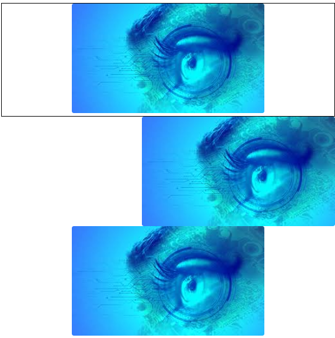

## Responsive images

```css
.img-fluid{
    max-width: 100%;
    height: auto;
}
```
width에 맞춰 height가 반응
height에 유의

## image thumbnails

- border-radius 적용
- border : 1px
- padding

## aligning images

float or text alignment 사용
block level image는 margin : 0 auto 사용

img의 default display는 inline-block.
https://stackoverflow.com/questions/2402761/is-img-element-block-level-or-inline-level

``` css
div{
  border: 1px solid;
  text-align: center;
}
.rounded{
  border-radius: 0.2em;
}

.float-right{
  float: right;
}
.mx-auto{
  display:block;
  margin: 0 auto;
}
```


