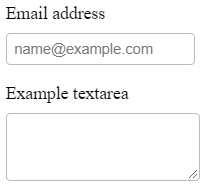

## Example

```html
<div class="mb-3">
  <label for="exampleFormControlInput1" class="form-label">Email address</label>
  <input type="email" class="form-control" id="exampleFormControlInput1" placeholder="name@example.com">
</div>
<div class="mb-3">
  <label for="exampleFormControlTextarea1" class="form-label">Example textarea</label>
  <textarea class="form-control" id="exampleFormControlTextarea1" rows="3"></textarea>
</div>
```
```css
*{
  box-sizing : border-box;
  margin: 0;
  padding: 0;
}
.container{
  border: 1px solid;
  padding: 1em;
}
.mb-3{
  margin-bottom: 1em;
}

.form-label{
  display:block;
  margin-bottom: 0.5rem;
}
.form-control{
  display:block;
  width: 100%;
  border: 1px solid #bbb;
  padding: 0.5em;
  border-radius: 0.3rem;
  margin-bottom: 0.5rem;
}
.form-control:focus {
  outline : none;
  border-color: #7ab1ff
;
  box-shadow : 0 0 0 3px #C2DBFE;
}
```


- border/outline/box-shadow
- 클릭시 outline을 없애고(radius outline 설정이 안 됨) 
- box-shadow 0 0 0 3px로 효과를 줬다.
- border로 설정할 경우 box-sizing issue 발생



## Sizing

```css

.form-control-lg{
  font-size: 1.2rem;
}
.form-control-sm{
  font-size: 0.7rem;
}
```
form control sizing에서 height를 set한다고 나와있지만
padding을 em으로 주고 font-size만 조정하면 height가 자연스럽게 변경된다.


## Readonly

- 태그 attribute에서 readonly(boolean) 속성을 넣어주면 input이 변하지 않는다.
- disabled와 유사하나 input standard cursor를 유지한다.

## Color

- color picker 코드 찾아볼 것

## Datalists

- <datalist>
- 목록 외에 user 입력을 받을 수 있고
- 여러 형태의 data 선택지를 제공하고 입력받을 수 있음.
- https://stackoverflow.com/questions/6865943/html-form-select-option-vs-datalist-option
- https://demo.agektmr.com/datalist/