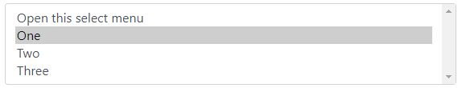

```html
<select class="form-select" aria-label="Default select example">
  <option selected>Open this select menu</option>
  <option value="1">One</option>
  <option value="2">Two</option>
  <option value="3">Three</option>
</select>
```

## sizing

- css는 form control과 동일

## 추가 속성
- multiple 속성 부여 시 scroll바가 생기며 다 수 선택지가 초기화면
- size 속성 부여 시 size만큼의 선택지가 초기화면으로 보여짐
