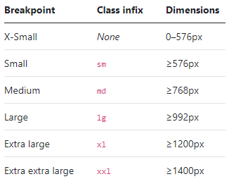

## 핵심

1. 반응형 디자인
2. mobile first
3. 미디어쿼리
    - mobile first여서 주로 min-width(min~ )를 사용

## breakpoints




### 6개로 구분

- xs 0~576px : xs은 class infix가 없음.
- `sm` 576~ 
- `md` 768~ 
- `lg` 992~ 
- `xl` 1200~ 
- `xxl` 1400~

## 디바이스 크기

### 1. [모바일 & 태블릿 크기 정리](https://www.mydevice.io/#compare-devices)

CSS width 기준 (세로 모드)

- 모바일 320 ~ 414
- 태블릿 600 ~ 1024


### 2. [가장 많이 사용되는 디바이스 크기 통계자료](https://www.hobo-web.co.uk/best-screen-size/)
  - 미국, 영국 기준
  - 모바일 : 360 x 640
  - 태블릿 : 768 x 1024
  - 데스크탑 : 1366 x 768, 1920 x 1080


## breakpoints & device

```scss
$grid-breakpoints: (
  xs: 0,
  sm: 576px,
  md: 768px,
  lg: 992px,
  xl: 1200px,
  xxl: 1400px
);
```

- **mobile 세로**
- sm ~ md : **mobile 가로**, 태블릿 일부
- **md ~ lg : 태블릿**
- lg ~ xl : 태블릿 일부, **데스크탑**
- **xl ~ : 대형 데스크탑**


## 부트스트랩 media query @include 방법

### 1. Min -width

```css
// Source mixins
@include media-breakpoint-up(sm) { ... }

// Example: Hide starting at `min-width: 0`, and then show at the `sm` breakpoint
.custom-class {
  display: none;
}
@include media-breakpoint-up(sm) {
  .custom-class {
    display: block;
  }
}
```

### 2. Max-width

```css
// Example: Style from medium breakpoint and down
@include media-breakpoint-down(md) {
  .custom-class {
    display: block;
  }
}

// Medium devices (tablets, less than 992px)
@media (max-width: 991.98px) { ... }
```

### 3. single, between

```css
 /* single */
@include media-breakpoint-only(md) { ... }

@media (min-width: 768px) and (max-width: 991.98px) { ... }

/* between */
@include media-breakpoint-between(md, xl) { ... }

@media (min-width: 768px) and (max-width: 1199.98px) { ... }
```