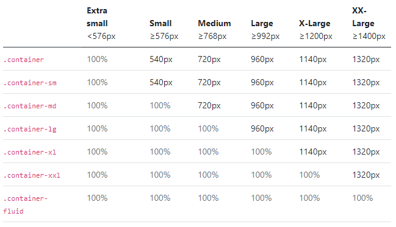

# Container

- container는 content를 담아 정렬하는 요소로 nesting이 가능
- but, 대부분의 레이아웃에서는 nesting이 필요하지 않아

## 동작 원리

### container는 3가지의 종류로 나뉜다.

1. `.container` : 각 breakpoint에서 정해져있는 max-width를 가진다.
2. `.container-fluid` : 모든 breakpoing에서 `width:100%`
3. `.container-{breakpoint}` : 정해진 breakpoint까지 `width:100%`

[bootstrap 컨테이너](https://v5.getbootstrap.com/docs/5.0/layout/containers/)
[bootstrap 그리드 시스템](https://v5.getbootstrap.com/docs/5.0/examples/grid/#containers)

### default

- 모든 breakpoint에서 responsive한 컨테이너
- css 속성 `max-width`에 의해 최대 가능 너비를 가진다.

### responsive 

- modifier로 지정된 breakpoint까지는 100% 너비를 갖는다.
- breakpoint를 초과하면 default처럼 동작한다.
- 정리하면 0~breakpoint : fluid, breakpoint~ : default

