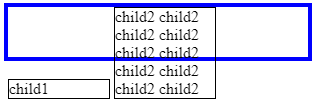

# flexbox

bootstrap5의 그리드 시스템은 flexbox로 구현되어 있다.

## why flexbox?

flexbox의 fallback 테크닉을 살펴보면 

### 1. float

**default setting**

in html
```html
<div class="parent">
  <div class="children child1">
    child1
  </div>
  <div class="children child2">
    child2
  </div>
</div>
```

in css
```css
div{
  border: 1px solid;
}

.parent{
  width:300px;
  border: 4px blue solid;
}

.parent:after{
  content:'';
  display:block;
  clear:left;
} 
```

1.

```css
.children{
   float:left;
   width:100px;
}
```


```css
.children{
   float:left;
   width:200px;
}
```


- children이 모두 float이므로 parent가 height를 잃게 되어 clear를 사용
- children의 height가 다를 경우, 낮은 height를 가지는 child는 상단을 기준으로 위치
- 아래 쪽에 공백 발생

### 2. inline-block

1.
```css
.children{
   display:inline-block;
   width:100px;
}
```


```css
.children{
  display:inline-block;
  width:200px;
}
```


```css

.parent{
  height: 50px;
}

.children{
   display:inline-block;
   width:100px;
}

```



- children의 height가 다를 경우, 낮은 height를 가지는 child는 가장 높은 height를 갖는 child의 하단을 기준으로 위치
- 위쪽에 공백 발생

### 3. table-cell

```css
.children{
   display:table-cell;
   width:100px;
}
```


```css
.children{
  display:table-cell;
  width:1000px;
}
```


- children의 높이가 가장 높은 child에 맞춰진다.
- children의 width가 parent의 width를 초과할 경우 children은 parent의 너비를 나눠 갖는다.

## flexbox

### flex-grow/shrink/basis

- default : 0/1/auto
- children은
- flex basis를 기준으로 
- basis보다 긴 width가 될 경우 flex-grow의 비율에 따라 늘어나며
- basis보다 짧은 width가 될 경우 flex-shrink의 비율에 따라 줄어든다.

<iframe style="overflow-y: auto; -webkit-overflow-scrolling: touch; display:block; vertical-align:top;" src="https://codepen.io/changhyun2/pen/OJMrqEW"></iframe>

https://css-tricks.com/snippets/css/a-guide-to-flexbox/#flexbox-background

### order

default : 0
순서에 따라 위치


# 그리드 시스템

- css [flexbox](https://css-tricks.com/snippets/css/a-guide-to-flexbox/#flexbox-background)로 구현
- 12 column 시스템
- 6개의 responsive tiers(breakpoints)

## 예제

https://v5.getbootstrap.com/docs/5.0/layout/grid/

```html
</div><div class="container">
  <div class="row">
    <div class="col-sm">
      One of three columns
    </div>
    <div class="col-sm">
      One of three columns
    </div>
  </div>
    <div class="row">
    <div class="col-sm">
      One of three columns
    </div>
    <div class="col-sm">
      One of three columns
    </div>
    <div class="col-sm">
      One of three columns
    </div>
  </div>
</div>
```

## 동작 원리

1. min-width 미디어 쿼리에 따라 breakpoint를 적용
   - .col-sm-4는 sm, md, lg, xl, xxl 미디어쿼리가 적용됨.
   - .col-lg-4는 lg, xl, xxl 미디어쿼리가 적용됨.
2. container는 content를 중앙정렬함.
   - margin: 0 auto (?)
3. row는 columns를 wrapping
   - display: flex (?)
4. 한 row당 12 columns를 가진다.
   - column은 .col-N으로 N개의 columns를 차지한다.
   - .col-N의 width는 percent.
5. gutter(padding) 또한 responsive(rem)하며 cutomizing 가능
6. sass mixin, maps, variables를 이용해 원하는 grid 생성 가능


## Columns

- 기본적으로 container는 flexbox
- .col은 flex:1인 듯
- .col-N은 width: percent인 듯
- .col-md-N은 container의 width가 md이상일 떄 /12이 됨.
- .col-6으로 비율을 정해주면 해당 column만 60%로 지정되는 듯
- .col-md-auto는 md이상에서 콘텐트 내용에 따라 width가 정해짐.

